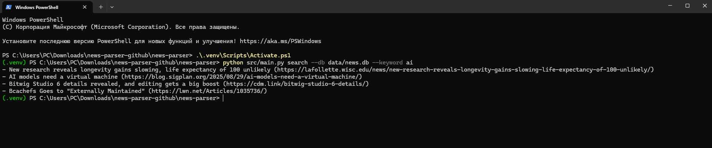

# News Parser (Python)

EN | RU

A simple news parser that fetches a page, extracts article links, and stores them to SQLite. Includes a small CLI with two commands: `fetch` and `search`.

## Quickstart
1. Create venv (optional): `python -m venv .venv` and activate it
2. Install deps: `pip install -r requirements.txt`
3. Fetch: `python src/main.py fetch --url https://example.com --db data/news.db`
4. Search: `python src/main.py search --db data/news.db --keyword example`

## Structure
- `src/main.py` — CLI and logic
- `data/` — SQLite DB location
- `docs/` — screenshots, notes
- `tests/` — unit tests

## RU
Простой парсер новостей: загружает HTML, извлекает заголовки и ссылки, сохраняет в SQLite. Используйте команды `fetch` и `search`.

## 📸 Example

Example of fetching and searching articles:

